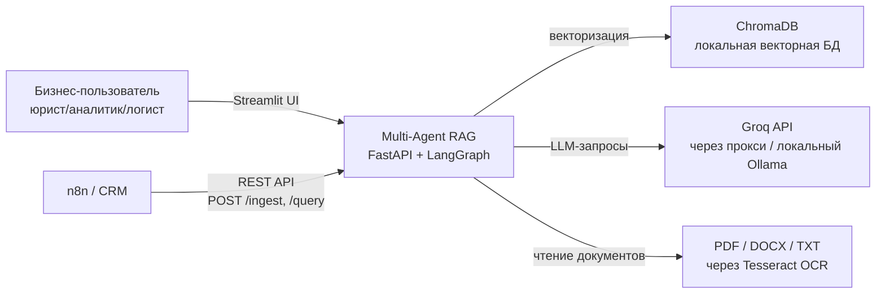
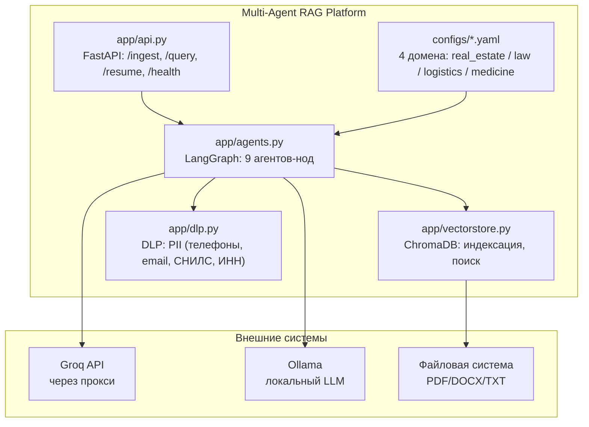
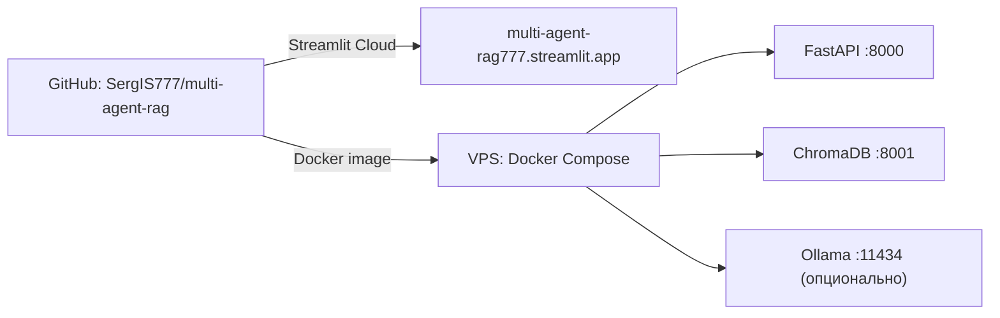

# Architecture — Multi-Agent RAG Platform

Документ оформлен по стандарту **arc42** (12 секций), диаграммы — по уровням **C4** в mermaid.

---

## 1. Введение и цели

**Multi-Agent RAG Platform** — конфиг-драйвен платформа для анализа документов: загрузил PDF/DOCX → задал вопрос → получил проверенный ответ с цитатами, скорингом рисков и стоимостью запроса в $. 9 агентов в LangGraph-графе, бизнес-правила в YAML, новый домен за 1 день без строчки кода.

### Топ-3 цели
1. **Анти-галлюцинации**: Reviewer-цикл ≤ 2 попыток + честный [FALLBACK] если LLM врёт
2. **Config-driven**: 4 домена из коробки (недвижимость, юристы, логистика, медицина), новый пишется за день
3. **Self-hosted**: данные не уходят за периметр, Groq через прокси или локальный LLM

### Стейкхолдеры
| Роль | Интерес |
|------|---------|
| Юрист/аналитик | точные ответы с цитатами, скоринг рисков (штрафы, неустойки) |
| Бизнес-пользователь | новый домен без кода, видимость стоимости запросов |
| Интегратор (n8n/CRM) | FastAPI REST API: POST /ingest, /query, /resume |
| DevOps | self-hosted, Docker, наблюдаемость через trace_id + JSON-лог |

---

## 2. Ограничения архитектуры

- **Без GPU**: внешний LLM (Groq free tier) или локальный Ollama
- **Self-hosted**: данные не уходят наружу (DLP до LLM, прокси для Groq)
- **Config-driven**: бизнес-правила в YAML, код не трогаем
- **Один разработчик**: решения оптимизированы под простоту поддержки

---

## 3. Контекст системы (C4 Level 1: Context)

**Бизнес-контекст:** компании тонут в документах (договоры, накладные, медицинские выписки). Менеджеры тратят часы на вычитку, упускают риски. Платформа автоматизирует: загрузка → индексация → вопрос → проверенный ответ с цитатами.

**Технический контекст:** FastAPI принимает запросы, LangGraph оркестрирует 9 агентов, ChromaDB хранит векторы, Groq/Ollama генерирует ответы. Всё self-hosted, данные не уходят наружу.

---

## 4. Стратегия решений

| Решение | Обоснование | Альтернатива (отклонена) |
|---------|-------------|--------------------------|
| LangGraph вместо LangChain agents | условные рёбра, циклы ревью, human-in-the-loop | LangChain agents: линейные, нет циклов |
| Config-driven (YAML) | новый домен = новый файл, код не трогаем | хардкод промптов: правка кода на каждый домен |
| ChromaDB локально | self-hosted, данные не уходят, быстро для <10k документов | Pinecone/Weaviate: платно, данные в облаке |
| FastAPI REST API | готовый контракт для n8n/CRM, Swagger из коробки | gRPC: сложнее интеграция |
| Groq через прокси | free tier, но данные через прокси → контроль | прямой Groq: быстрее, но данные уходят |
| Tesseract OCR | бесплатно, читает сканы PDF | платные OCR API: дорого |
| Reviewer-цикл ≤ 2 | баланс: качество vs latency, честный FALLBACK если LLM врёт | без ревью: галлюцинации |

---

## 5. Структура блоков (C4 Level 2: Container, Level 3: Component)

**Таблица-карта файлов:**
| Файл | Роль | Связан с |
|------|------|----------|
| `app/api.py` | FastAPI REST API: POST /ingest, /query, /resume + GET /health | app/agents.py, configs/ |
| `app/agents.py` | LangGraph-граф: 9 агентов-нод с условными рёбрами | configs/, app/vectorstore.py |
| `app/vectorstore.py` | ChromaDB: индексация документов, поиск по векторам | app/agents.py |
| `app/dlp.py` | DLP: фильтрация PII (телефоны, email, СНИЛС, ИНН, паспорт) до LLM | app/agents.py |
| `configs/*.yaml` | бизнес-правила для 4 доменов (real_estate, law, logistics, medicine) | app/agents.py |
| `tests/` | pytest: 8 тестов (guard, extractor, cost, false-positive) | CI (.github/workflows) |
| `docs/` | документация: API, примеры запросов | README.md |
| `run_demo.py` | скрипт запуска демо (Streamlit Cloud) | app/api.py |
| `requirements.txt` | зависимости: fastapi, langgraph, chromadb, pydantic, uvicorn | деплой |
| `.env.example` | шаблон секретов: GROQ_API_KEY, OLLAMA_BASE_URL | /root/.multi-agent-rag.env |
| `.github/workflows/` | CI: прогон pytest на каждый push | tests/ |

**Точка входа:** чтение начинай с `app/agents.py` — там весь граф; конфиги доменов — в `configs/`.

---

## 6. Runtime-сценарии

**Сценарий 1 — загрузка и индексация документа:**
1. POST /ingest с PDF/DOCX/TXT файлом
2. Tesseract OCR читает сканы (если PDF)
3. Ingestor-агент парсит документ на чанки
4. Indexer-агент векторизует чанки → ChromaDB
5. Возвращает doc_id для последующих запросов

**Сценарий 2 — вопрос к документу:**
1. POST /query с question и doc_id
2. Guard-агент: DLP проверяет вопрос на PII (телефоны, email) → блокирует если нужно
3. Retriever-агент: поиск релевантных чанков в ChromaDB (top-5)
4. Extractor-агент: извлекает факты из чанков (даты, суммы, имена)
5. Answerer-агент: генерирует ответ с цитатами [0][1][2]
6. Reviewer-агент: проверяет ответ на галлюцинации (≤ 2 попытки)
7. Если медицина/юриспруденция: Human-in-the-loop → граф останавливается, человек подтверждает
8. Возвращает ответ с цитатами, скорингом рисков, cost_usd

**Сценарий 3 — деградация при отказах:**
1. Groq API недоступен (403) → fallback на Ollama (локальный LLM)
2. LLM генерирует галлюцинацию → Reviewer бракует → [FALLBACK] "Не могу найти точный ответ"
3. Превышен max_tokens_per_query → честный отказ, cost_usd в ответе

**Сценарий 4 — наблюдаемость:**
1. Каждый запрос получает trace_id
2. JSON-лог: ноды → latency_ms → токены → cost_usd
3. Streamlit UI показывает цепочку агентов для дебага

---

## 7. Деплой и масштабирование

**Текущая инфраструктура:**
- Streamlit Cloud: публичное демо (бесплатно, автодеплой)
- VPS (опционально): Docker Compose с FastAPI + ChromaDB + Ollama

**План масштабирования:**
| Рост | Узкое место | Решение |
|------|-------------|---------|
| 10k+ документов | ChromaDB в памяти | PostgreSQL + pgvector |
| 100+ одновременных запросов | один инстанс FastAPI | несколько workers + LB |
| GPU для локального LLM | нет GPU | DGX / GPU-сервер + vLLM |
| production-данные | free tier Groq | платный API + rate limiting |

**Восстановление при падении:** всё stateless и в Git: код в `app/`, конфиги в `configs/`, секреты в `.env`. Docker Compose up → система жива. ChromaDB можно перестроить из исходных документов.

---

## 8. Сквозные концепции

- **Config-driven**: бизнес-правила в `configs/*.yaml`, код не трогаем
- **DLP до LLM**: PII (телефоны, email, СНИЛС, ИНН, паспорт) фильтруются ДО отправки в модель
- **Reviewer-цикл**: ≤ 2 попытки проверки ответа, честный [FALLBACK] если LLM врёт
- **Human-in-the-loop**: для медицины/юриспруденции граф останавливается, человек подтверждает
- **Cost control**: лимит max_tokens_per_query в YAML, cost_usd в каждом ответе
- **Наблюдаемость**: trace_id + JSON-лог (нода → latency_ms → токены)
- **RetryPolicy**: 3 попытки с backoff для внешних API

---

## 9. Архитектурные решения (ADR-lite)

**ADR-1: LangGraph вместо LangChain agents.** Условные рёбра и циклы ревью критичны для анти-галлюцинаций. LangChain agents линейные, не подходят.

**ADR-2: Config-driven домены.** 4 домена описаны YAML-конфигами; новый домен = новый файл, код не правим. Альтернатива (хардкод) отклонена: правка кода на каждый домен = техдолг.

**ADR-3: ChromaDB локально вместо Pinecone.** Self-hosted, данные не уходят, быстро для <10k документов. Альтернатива (Pinecone) отклонена: платно, данные в облаке.

**ADR-4: Groq через прокси.** Free tier, но данные через прокси → контроль. Альтернатива (прямой Groq) отклонена: данные уходят наружу.

**ADR-5: Reviewer-цикл ≤ 2 попытки.** Баланс: качество vs latency. Если LLM врёт дважды — честный [FALLBACK]. Альтернатива (без ревью) отклонена: галлюцинации.

**ADR-6: Tesseract OCR для сканов.** Бесплатно, читает PDF-сканы. Альтернатива (платные OCR API) отклонена: дорого.

---

## 10. Требования к качеству

| Требование | Сценарий | Целевая метрика |
|------------|----------|-----------------|
| Анти-галлюцинации | LLM генерирует ложный факт | Reviewer бракует ≤ 2 попытки, [FALLBACK] |
| Cost control | превышен лимит токенов | честный отказ, cost_usd в ответе |
| DLP | вопрос содержит PII | Guard блокирует до LLM |
| Latency | запрос к документу | < 5 с (Groq), < 10 с (Ollama) |
| Тестируемость | правка DLP / extractor | 8 pytest passing |
| Наблюдаемость | дебаг запроса | trace_id + JSON-лог цепочки |

---

## 11. Риски и технический долг

**Риски:**
- Урежут free tier Groq → митигация: fallback на Ollama (локальный LLM)
- ChromaDB не масштабируется на 100k+ документов → митигация: миграция на pgvector (секция 7)
- Tesseract медленный на больших PDF → митигация: асинхронная обработка

**Осознанные решения (не «недоделки»):**
- Тесты покрывают DLP (guard), extractor, cost — 8 pytest passing; полный E2E тестируется через Streamlit UI
- Human-in-the-loop только для медицины/юриспруденции; для недвижимости/логистики — автоматом (быстрее)
- ChromaDB в памяти для демо; production → pgvector (зафиксировано в плане масштабирования)

---

## 12. Глоссарий

| Термин | Значение |
|--------|----------|
| LangGraph | оркестрация агентов с условными рёбрами и циклами |
| Config-driven | бизнес-правила в YAML, код не меняется |
| DLP | Data Loss Prevention — фильтрация PII до LLM |
| Reviewer-цикл | проверка ответа LLM на галлюцинации (≤ 2 попытки) |
| Human-in-the-loop | граф останавливается, человек подтверждает ответ |
| trace_id | уникальный ID запроса для наблюдаемости |
| cost_usd | стоимость запроса в $ (лимит в YAML) |

---

## Как менять этот проект

| Хочу… | Куда идти |
|-------|-----------|
| новый домен (бизнес-правила) | `configs/*.yaml` (новый файл) |
| новый агент в граф | `app/agents.py` (LangGraph-граф) |
| новая DLP-защита | `app/dlp.py` + tests/ |
| новый endpoint API | `app/api.py` (FastAPI) |
| поменять лимит токенов | `configs/*.yaml` (max_tokens_per_query) |
| секретные ключи | `.env` (шаблон — `.env.example`) |

После правки: коммит в GitHub → Docker rebuild → FastAPI restart. API и граф оживают без пересборки Streamlit.
